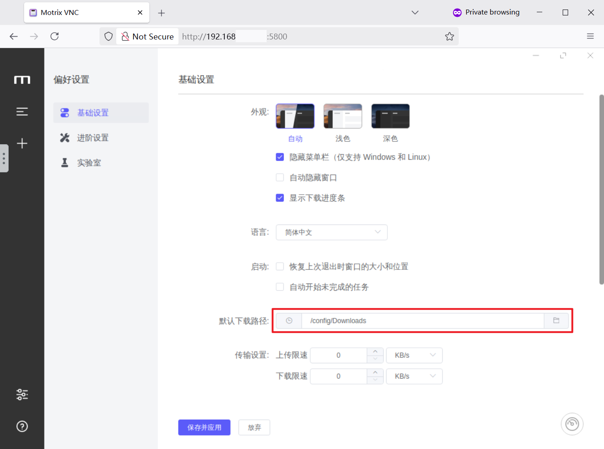

# Motrix-arm64-vnc

<a href="https://hub.docker.com/r/emuqi/motrix-arm64-vnc">

</a>
<a href="https://hub.docker.com/r/emuqi/motrix-arm64-vnc">

</a>
<a href="https://github.com/eMUQI/motrix-arm64-vnc">

</a>
</br></br>

本项目将 [Motrix](https://github.com/agalwood/Motrix) 官方 Linux ARM64 版本封装于 Docker 容器中，并通过 VNC 提供图形用户界面（GUI）访问。用户可通过 Web 浏览器（noVNC）或 VNC 客户端进行连接。

该镜像基于 Motrix 官方发行版构建，已在树莓派 5 上测试过。理论上，它兼容其他所有符合 ARM64 架构的设备。

## 部署流程

### 1. 前置条件

请确保您的宿主机系统已安装 Docker 及 Docker Compose。

### 2. 创建并配置 `docker-compose.yml`

在宿主机上创建项目目录，并在该目录中新建 `docker-compose.yml` 文件。

```bash
mkdir motrix-server
cd motrix-server
touch docker-compose.yml
```

将以下内容写入 `docker-compose.yml` 文件：

```yaml
services:
  motrix:
    image: emuqi/motrix-arm64-vnc:latest
    container_name: motrix-vnc
    ports:
      # 5800: 用于 noVNC (Web 浏览器) 访问的端口
      - "5800:5800"
      # 5900: (可选) 用于标准 VNC 客户端直接访问的端口
      - "5900:5900"
    volumes:
      # 将宿主机的 ./data 目录映射到容器的 /config/Downloads 目录
      # 用于持久化存储下载的文件
      - ./data:/config/Downloads
    environment:
      # 关键：设置容器内应用的用户与用户组 ID。
      # 建议修改为宿主机当前用户的 UID 和 GID，以避免挂载目录的权限冲突。
      # 可在宿主机终端执行 `id` 命令获取。
      - USER_ID=1000
      - GROUP_ID=1000
      # 设置 VNC 会话的显示分辨率
      - DISPLAY_WIDTH=1280
      - DISPLAY_HEIGHT=720
      # (可选) 设置 VNC 访问密码。取消注释并替换为强密码。
      # - VNC_PASSWORD=your_secret_password
    restart: unless-stopped
```

### 3. 启动容器服务

在 `docker-compose.yml` 文件所在的目录下，执行以下命令以启动服务：

```bash
docker compose up -d
```

## 访问方式

*   **Web 浏览器 (noVNC):**
    访问 `http://<宿主机IP地址>:5800`

*   **VNC 客户端:**
    使用 VNC 客户端 (如 RealVNC Viewer, TigerVNC) 连接至 `vnc://<宿主机IP地址>:5900`

## 关键配置：设定下载路径

为确保下载文件能正确保存至宿主机映射目录，首次启动后必须在 Motrix 应用内完成以下配置：

1.  在 Motrix 图形界面中，导航至 **偏好设置** -> **基础设置**。
2.  定位到 **下载路径** 选项，点击 **“更改”**。
3.  将路径手动设置为容器内部的绝对路径：`/config/Downloads`。
    
4.  保存并应用设置。

此操作为一次性配置。完成后，所有下载任务产生的文件都将被存储在宿主机的 `./data` 目录中。

## 环境变量参考

| 环境变量 | 描述 | 默认值 |
| :--- | :--- | :--- |
| `USER_ID` | 定义容器内运行 Motrix 进程的用户 ID (UID)。 | `1000` |
| `GROUP_ID` | 定义容器内运行 Motrix 进程的用户组 ID (GID)。 | `1000` |
| `DISPLAY_WIDTH` | VNC 会话的屏幕显示宽度（单位：像素）。 | `1280` |
| `DISPLAY_HEIGHT` | VNC 会话的屏幕显示高度（单位：像素）。 | `720` |
| `VNC_PASSWORD` | 为 VNC 服务设置连接密码。若留空或注释，则无需密码即可访问。 | (未设置) |